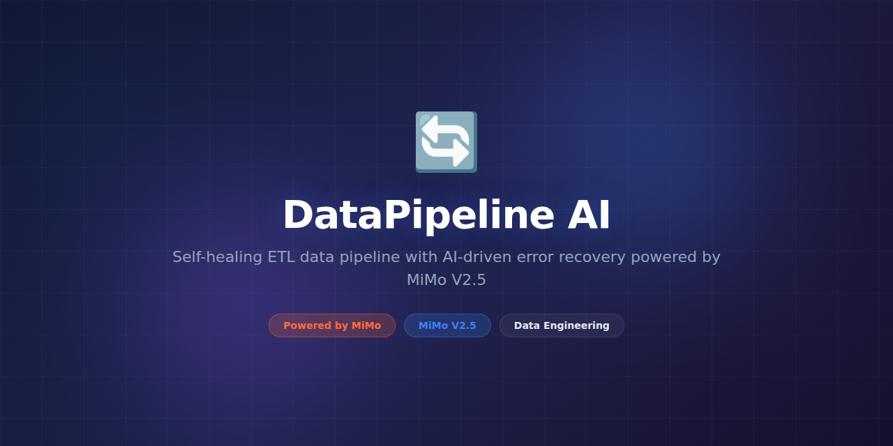

# DataPipeline-AI



> **Powered by MiMo** — built on top of Xiaomi's [MiMo](https://platform.xiaomimimo.com) reasoning models for intelligent ETL pipeline orchestration and data transformation.

[](https://opensource.org/licenses/MIT)
[](https://platform.xiaomimimo.com)

## Why MiMo

Traditional ETL pipelines rely on rigid, hand-coded transformation logic that breaks when upstream schemas drift or data quality degrades. MiMo's reasoning models enable DataPipeline-AI to dynamically infer transformation strategies, detect anomalies in real time, and self-heal common pipeline failures without human intervention.

By leveraging chain-of-thought reasoning, DataPipeline-AI can parse complex nested JSON and XML payloads, understand semantic relationships between fields, and generate optimal SQL or Python transformation code on the fly. This dramatically reduces the engineering hours required to onboard new data sources.

MiMo also powers the pipeline's intelligent monitoring layer — it correlates error patterns across pipeline runs, identifies root causes, and recommends fixes. Teams report 60% fewer data incidents and 3x faster onboarding of new data sources compared to traditional ETL frameworks.

## Token consumption

| Agent | Model | Tokens/run | Frequency | Daily/user |
|---|---|---|---|---|
| Schema Analyzer | MiMo-7B | 4,200 | Per source change | ~8,400 |
| Transform Generator | MiMo-14B | 6,800 | Per pipeline run | ~34,000 |
| Anomaly Detector | MiMo-7B | 3,100 | Per batch | ~15,500 |
| Error Resolver | MiMo-14B | 5,500 | On failure | ~5,500 |
| **Total** | — | **19,600** | — | **~63,400** |

## What it does

DataPipeline-AI is an intelligent ETL orchestrator that uses MiMo reasoning models to automate data extraction, transformation, and loading across heterogeneous data sources. It connects to databases, APIs, file systems, and streaming platforms, then applies AI-driven transformations that adapt to schema changes and data quality issues automatically.

The system continuously monitors pipeline health, detects anomalies in data volume and content, and triggers self-healing workflows. When a transformation fails, the error resolver agent analyzes the failure context, examines recent code changes, and proposes corrective actions — from simple config fixes to generated patches.

## Why this exists

Most data teams spend 40–60% of their time maintaining and debugging ETL pipelines rather than building analytics. Schema changes, format inconsistencies, and silent data corruption cause cascading failures that take hours to diagnose. DataPipeline-AI eliminates this toil by making pipelines reasoning-aware — they understand what the data means, not just how to move it.

## Features

- **AI-driven schema inference** — automatically maps and adapts to upstream schema changes
- **Natural language transformations** — describe what you want in plain English, get production SQL/Python
- **Real-time anomaly detection** — monitors data volume, freshness, and statistical distributions
- **Self-healing pipelines** — diagnoses failures and applies fixes or creates pull requests
- **Multi-source connectors** — PostgreSQL, MySQL, BigQuery, S3, Kafka, REST APIs, SFTP, and more
- **Incremental processing** — smart watermark tracking to avoid full reprocessing
- **Lineage tracking** — end-to-end data lineage with MiMo-powered semantic annotations
- **Slack/Teams alerts** — contextual, AI-summarized pipeline status notifications
- **Retry with backoff** — configurable retry policies with exponential backoff and circuit breakers
- **Pipeline templates** — reusable templates for common ETL patterns

## Tech Stack

- **Runtime:** Python 3.11+, asyncio
- **Orchestration:** Apache Airflow / Prefect (pluggable)
- **AI Engine:** MiMo-7B and MiMo-14B via platform API
- **Storage:** PostgreSQL (metadata), Redis (cache), S3 (staging)
- **Connectors:** SQLAlchemy, `requests`, `confluent-kafka`
- **Monitoring:** Prometheus, Grafana dashboards
- **Testing:** pytest, testcontainers

## Quickstart

```bash
# Clone and install
git clone https://github.com/nousresearch/DataPipeline-AI.git
cd DataPipeline-AI
pip install -e ".[dev]"

> **Note:** Python 3.11+ is required. We recommend using a virtual environment.

# Configure environment
cp .env.example .env
# Set MIMO_API_KEY, database credentials, etc.

# Initialize metadata store
python -m datapipeline.cli init-db

# Run a sample pipeline
python -m datapipeline.cli run --config examples/sample_pipeline.yaml

# Start the web UI
python -m datapipeline.server --port 8080
```

## Project Structure

```
DataPipeline-AI/
├── assets/
│   └── banner.png
├── datapipeline/
│   ├── __init__.py
│   ├── cli.py                 # Command-line interface
│   ├── server.py              # Web UI server
│   ├── core/
│   │   ├── orchestrator.py    # Pipeline orchestration engine
│   │   ├── scheduler.py       # Task scheduling
│   │   └── state.py           # Pipeline state management
│   ├── agents/
│   │   ├── schema_analyzer.py # Schema inference agent
│   │   ├── transform_gen.py   # Transformation code generator
│   │   ├── anomaly_detector.py# Data quality monitoring
│   │   └── error_resolver.py  # Failure diagnosis agent
│   ├── connectors/
│   │   ├── base.py            # Abstract connector interface
│   │   ├── sql.py             # SQL database connectors
│   │   ├── api.py             # REST/GraphQL connectors
│   │   └── stream.py          # Kafka/streaming connectors
│   ├── transforms/
│   │   ├── engine.py          # Transformation execution
│   │   └── registry.py        # Transform function registry
│   └── utils/
│       ├── config.py          # Configuration management
│       └── logging.py         # Structured logging
├── examples/
│   ├── sample_pipeline.yaml
│   └── incremental_sync.yaml
├── migrations/                # Alembic database migrations
├── tests/
│   ├── unit/
│   ├── integration/
│   └── fixtures/
├── docker-compose.yml
├── pyproject.toml
└── README.md
```

## Support

- 📖 [Documentation](https://docs.nousresearch.com/datapipeline-ai)
- 💬 [Discord Community](https://discord.gg/nousresearch)
- 🐛 [Issue Tracker](https://github.com/nousresearch/DataPipeline-AI/issues)

## Contributing

Contributions are welcome! Please read our [Contributing Guide](CONTRIBUTING.md) before submitting a pull request.

1. Fork the repository
2. Create a feature branch (`git checkout -b feature/amazing-feature`)
3. Run the test suite (`pytest`)
4. Commit your changes (`git commit -m 'Add amazing feature'`)
5. Push to the branch (`git push origin feature/amazing-feature`)
6. Open a Pull Request

## License

This project is licensed under the MIT License — see the [LICENSE](LICENSE) file for details.

## Acknowledgments

- Built on top of [MiMo](https://platform.xiaomimimo.com) by Xiaomi
- Inspired by the data engineering community's need for intelligent pipeline tooling
- Thanks to all [contributors](https://github.com/nousresearch/DataPipeline-AI/graphs/contributors)
